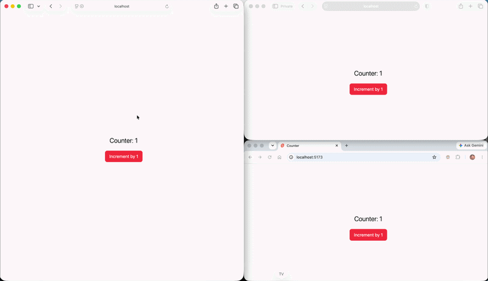

# SvelteKit Remote Functions – Real-Time Counter (Without WebSockets)

A simple demonstration of SvelteKit Remote Functions where a server-side counter increments automatically every second, and every connected client always sees the latest value without using WebSockets, Server-Sent Events (SSE), or any custom real-time protocol.

## ✨ Features
* 🚀 Built with the latest SvelteKit Remote Functions
* 🔄 Shared server-side counter
* ⏱️ Counter increments automatically every second
* 🌍 Every connected user receives the latest value
* ❌ No WebSockets
* ❌ No Server-Sent Events (SSE)
* ❌ No Socket.IO
* 📦 Minimal implementation showcasing the capabilities of Remote Functions

## How It Works

The application maintains a single counter on the server.

Each click on button increment +1:

1. The server increments the counter.
2. Clients request the current value through a Remote Function.
3. Since every client reads the same server state, all users observe the same counter value in near real time.

This demonstrates that Remote Functions can be used to synchronize server state across multiple clients without maintaining persistent socket connections.
